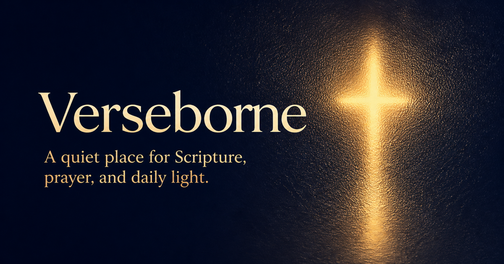
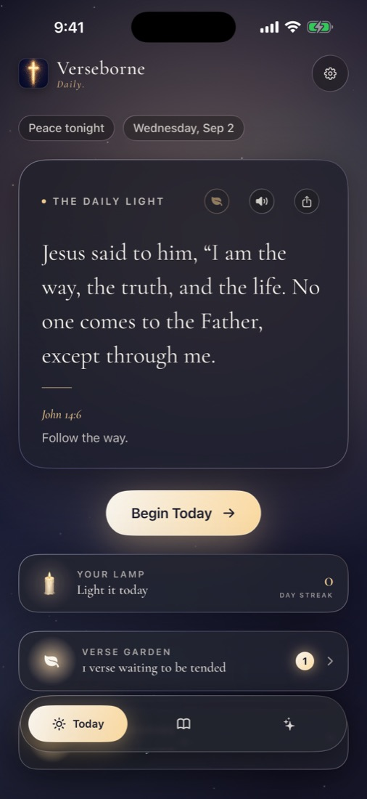
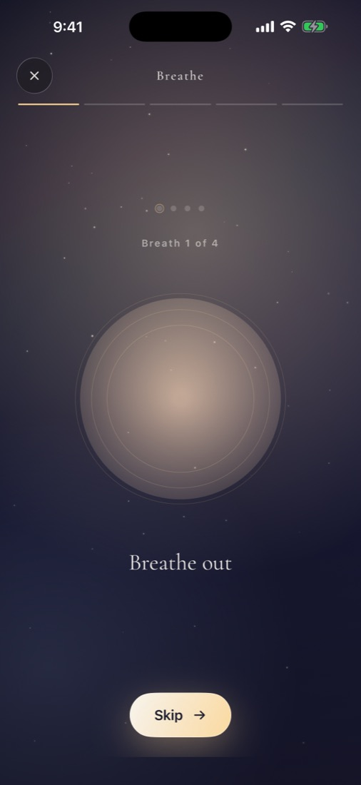
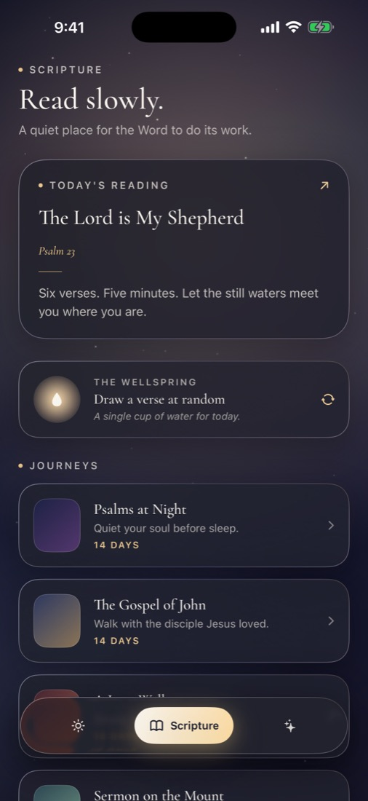
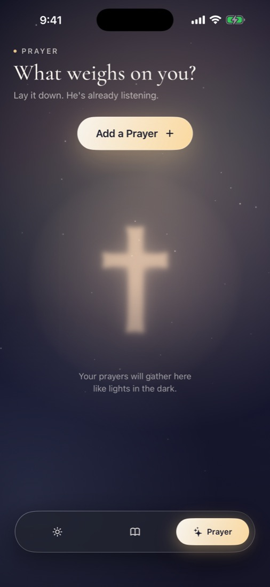
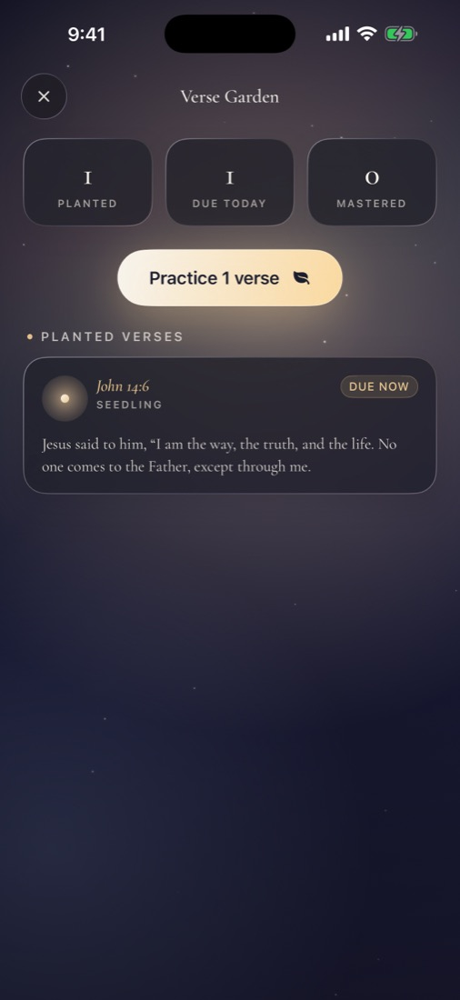

  

<h1 align="center">Verseborne — iOS Product Showcase</h1>

  A private-by-design Scripture and prayer companion for iPhone and iPad.

  <strong>SwiftUI</strong> · <strong>StoreKit 2</strong> · <strong>WidgetKit</strong> · <strong>Local-first</strong> · <strong>App Store release</strong>

Verseborne is devotional software designed to feel more like a place than a feed. It combines an atmospheric native interface with guided daily practice, focused Scripture journeys, private prayer and reflection, verse memorization, spoken Scripture, reminders, and a home-screen widget.

Version 1.0 has been submitted to App Review. The core experience is free, with an optional **$9.99 one-time Verseborne+ lifetime unlock** and no recurring subscription.

> This repository is a public product and engineering case study. The production source remains private to protect a commercial application.

## Product gallery

  
  
  
  
  

## The experience

- **Daily Light:** a focused Breathe → Read → Reflect → Pray → Carry ritual built around the verse of the day
- **Scripture journeys:** multi-day reading plans, a daily passage, and the Wellspring verse-discovery experience
- **Prayer and Light Kept:** private, on-device prayer and reflection tools with no account required
- **Verse Garden:** a visual memory practice that helps planted verses grow toward mastery
- **Thoughtful sensory design:** atmospheric backgrounds, custom glass surfaces, restrained haptics, spoken-word highlighting, and Reduce Motion support
- **Across Apple devices:** adaptive iPhone and iPad layouts plus small, medium, and large WidgetKit families

## Native engineering

| Area | Approach |
| --- | --- |
| Interface | SwiftUI lifecycle, custom design system, adaptive layouts, Dynamic Type, VoiceOver semantics, and accessibility-aware motion |
| State | Observation-based stores with clear boundaries between settings, devotional content, private writing, progress, and commerce |
| Commerce | StoreKit 2 lifetime purchase with localized pricing, verification, restore, cancellation, delayed approval, transaction updates, and revocation handling |
| Persistence | Protected on-device JSON for prayers and reflections; App Group state shared only with the widget |
| Platform | WidgetKit, local notifications, AVSpeechSynthesizer, native sharing, and haptics |
| Privacy | No backend, accounts, advertising, analytics, tracking, or third-party SDKs |

See the [architecture overview](docs/ARCHITECTURE.md) for the system boundaries and data-flow decisions.

## From product idea to App Store

| Phase | Outcome |
| --- | --- |
| Product direction | A calm daily ritual with a distinctive illuminated-night visual language |
| Native build | Full iPhone and iPad app, widget extension, local persistence, reminders, speech, sharing, and accessibility behavior |
| Monetization | Free core experience plus a non-consumable Verseborne+ lifetime purchase |
| Privacy | Local-first data model, complete file protection for private writing, privacy manifests, and matching public disclosures |
| Release | App Store listing, screenshots, rights audit, TestFlight verification, StoreKit QA, signed archive, and review submission |

Read the full [product and engineering case study](docs/CASE_STUDY.md) and [release QA summary](docs/RELEASE_QA.md).

## Release quality

Before submission, the release candidate was exercised across iPhone and iPad layouts, large Dynamic Type, Reduce Motion, all widget families, local notification permission states, and StoreKit edge cases. Debug and Release configurations built with warnings treated as errors; the final arm64 archive and distribution package passed entitlement, privacy-manifest, and signature checks.

The processed TestFlight build was also validated on physical hardware, including the Verseborne+ purchase and restore flow.

## Availability

- iOS and iPadOS 17 or later
- Version 1.0 submitted to App Review on September 2, 2026
- [Support and privacy site](https://verseborne.dkrause.chatgpt.site)
- App Store link will be added after approval and manual release

## About this showcase

Verseborne was created by [Dylan Krause](https://github.com/DylPickle-12) as an end-to-end product spanning interaction design, native iOS engineering, privacy, monetization, accessibility, release QA, App Store operations, and support-site delivery.

Copyright © 2026 Dylan Krause. Product imagery and written materials in this showcase are all rights reserved. Scripture shown in the app uses the public-domain World English Bible; Cormorant Garamond is licensed under the SIL Open Font License 1.1.
