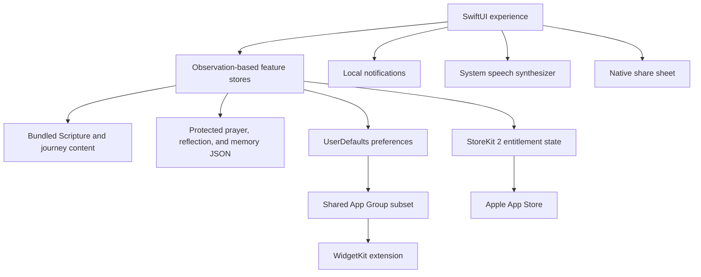

# Architecture overview

Verseborne is intentionally local-first. The application works without a developer account system or backend, while Apple platform services provide purchases, notifications, speech, sharing, and widgets.

## Boundary decisions

### User-authored content

Prayers, reflections, and verse-memory records are encoded into files inside Application Support using complete iOS file protection. The prototype's earlier preference-based records migrate once into protected files and are then removed from their legacy location.

### Widget sharing

The widget does not need access to private writing. Its App Group boundary is limited to the daily verse, lamp state, selected appearance values, and premium appearance entitlement required to render a timeline.

### Commerce

One StoreKit-facing store owns product loading, purchase state, entitlement refresh, restore, transaction updates, and revocation. Views consume a simple premium state and do not grant access based on unverified or cached purchase results alone.

### Privacy

Removing the backend was a deliberate architectural choice, not simply a missing feature. It eliminates account credentials, remote user-content storage, analytics identifiers, advertising profiles, and a large class of network failure states.

### Accessibility

Reduce Motion is treated as a live environment input throughout animated surfaces. Dynamic Type, explicit accessibility labels and actions, readable contrast, and minimum interaction targets are part of component behavior rather than a final overlay.

## Technology map

| Layer | Technology |
| --- | --- |
| Application UI | SwiftUI |
| State observation | Observation framework |
| Purchases | StoreKit 2 |
| Widget | WidgetKit and App Groups |
| Private persistence | Codable JSON and iOS file protection |
| Preferences | UserDefaults |
| Reminders | UserNotifications |
| Spoken Scripture | AVSpeechSynthesizer |
| Sharing | Native activity sheet |
| Support site | React, Vinext, and OpenAI Sites |
